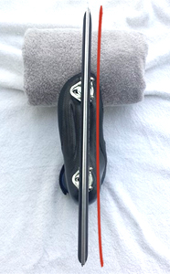
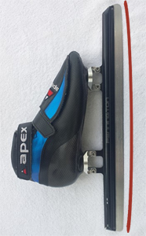
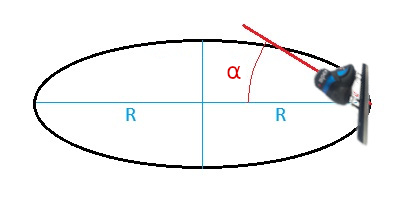
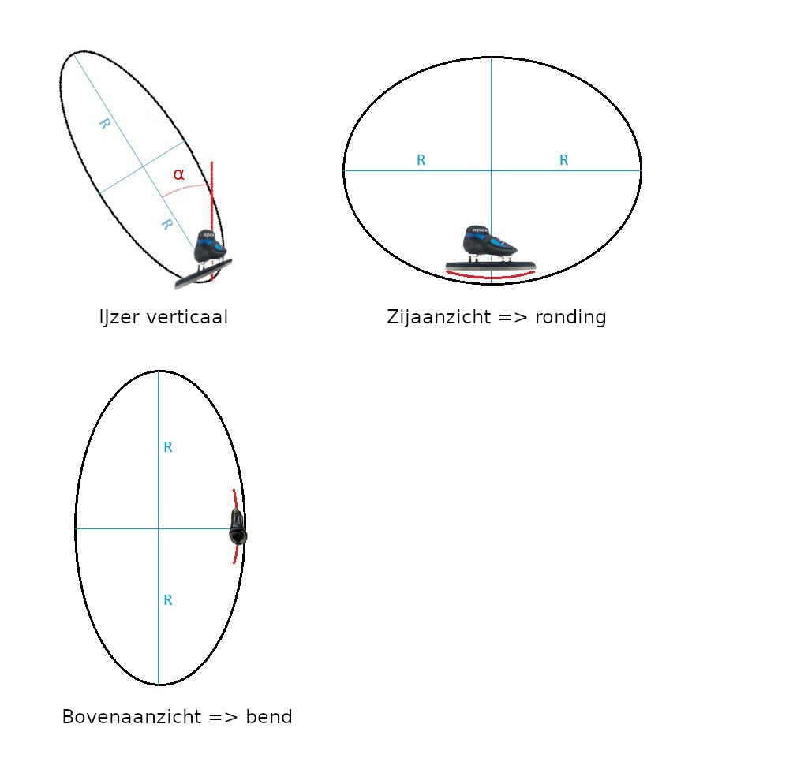
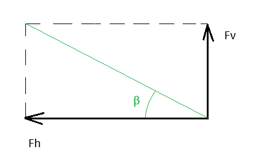
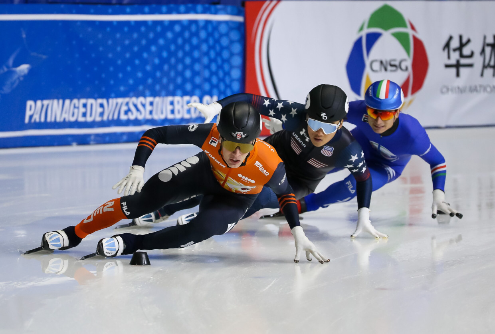
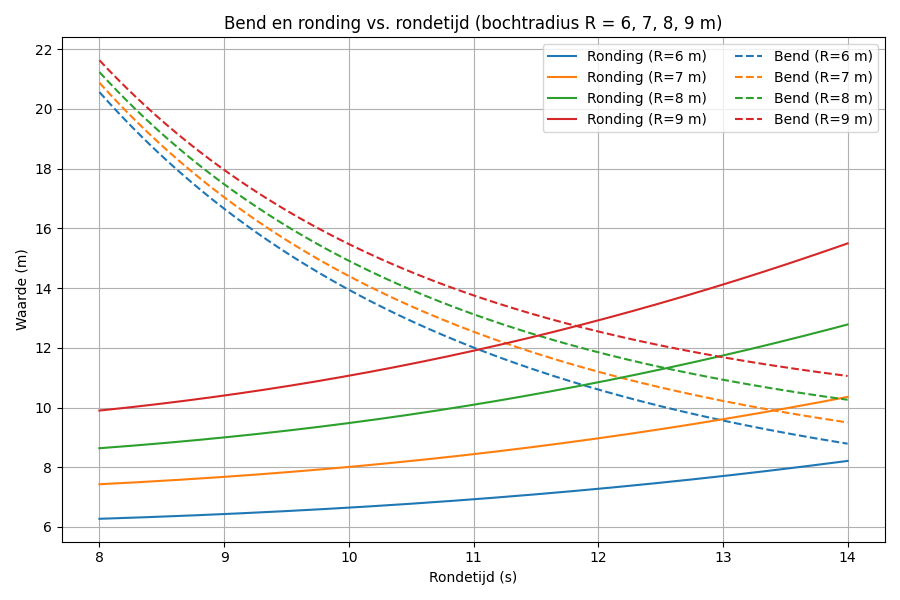
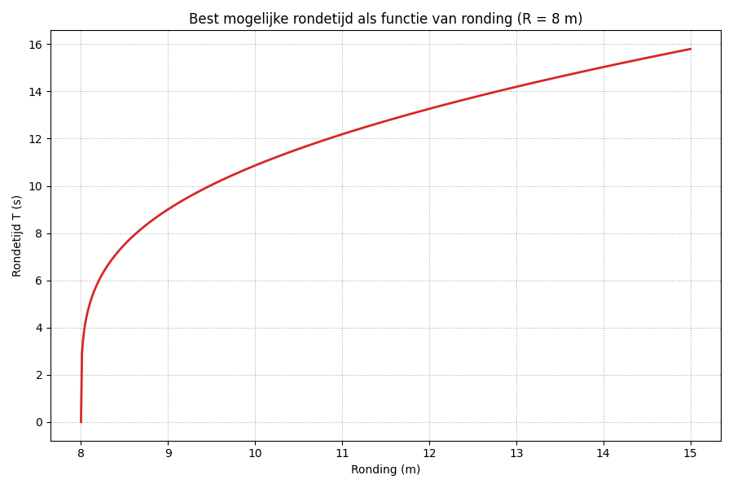
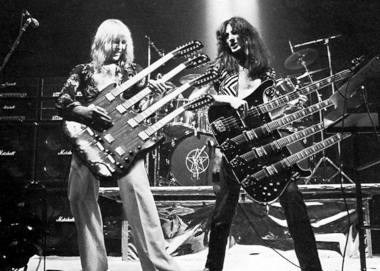

# Bend en Ronding bij shorttrack
Aan het einde van het vorige shorttrack seizoen had ik een discussie met wat mede-shorttrackers over bend en ronding. Eigenlijk leek niemand te weten hoe het nou precies zat. Ik had zelf al wel wat zitten puzzelen op dit onderwerp, en beloofde een en ander eens op papier te zetten. Bij deze het resultaat.

## Disclaimer
Ik heb geen idee met welke bend en/of ronding ervaren shorttrackers in de praktijk rijden. Ik heb op het moment dat ik dit schrijf nog maar 2 seizoenen aan shorttrack gedaan, en wordt dus niet gehinderd door veel kennis of ervaring. Juist omdat ik die kennis over bend en ronding niet heb, en omdat hierover ook erg weinig te vinden is op het internet, leek het me interessant om eens uit te pluizen hoe het zou kunnen werken. Wat hierbij trouwens ook een motivatie was, was het gevoel dat de 'fabrieksinstellingen' van mijn (pre-bent) ijzers mij af en toe tegenhielden. Ga er alsjeblieft niet van uit dat ik in dit document zekerheden verkondig. Ik kan het allemaal helemaal mis hebben, en dan hoor ik het graag.

## Termen
* Bend: de buiging van het ijzer in de horizontale richting, wanneer de schaatser rechtop staat. 

* Ronding / rocker: de buiging van het ijzer in de verticale richting, wanneer de schaatser rechtop staat. 

## De theorie
Ik ga uit van de aanname dat de combinatie van bend en ronding ervoor moet zorgen dat het ijzer als vanzelf een bocht wil rijden. De straal van die bocht zou gelijk kunnen zijn aan die van de shorttrack-bocht, dus 8 meter, maar ik kan me ook voorstellen dat je de straal kleiner wilt hebben, bijvoorbeeld omdat je wilt dat je ijzer aan het eind van je afzet vanzelf naar binnen draait, of omdat je iemand binnendoor wilt inhalen. Wat voor bocht het ijzer zou moeten rijden laat ik in het midden. Waar het om gaat is dat als je wilt dat je ijzer als vanzelf een bepaalde bocht beschrijft, de daarvoor benodigde bend en ronding worden bepaald door de combinatie van de hoek die je ijzer met het ijs maakt en de straal van de bocht die wilt rijden.

Voor het begrip vond ik het zelf ook handig om de twee uiterste gevallen te bekijken:
* In het ene uiterste geval ga je extreem langzaam over het ijs. Je ijzer staan dan loodrecht op het ijs. Als je wilt dat je ijzer vanzelf de bocht volgt, dan moet dat volledig door de bend komen. De ronding mag hier compleet ontbreken (ofwel plat zijn) (even afgezien van het feit dat je dan niet meer kunt bijsturen).
* In het andere uiterste geval ga je oneindig snel over het ijs. Je ijzer ligt dan plat op het ijs. Als je wilt dat je ijzer vanzelf de bocht volgt, dan moet dat volledig door de ronding komen. De bend mag hier compleet ontbreken (ofwel helemaal recht zijn).

Dat leidt alvast tot deze conclusie: hoe schuiner je door de bocht gaat, hoe sterker je ronding moet zijn, en hoe minder sterk je bend hoeft te zijn.

### Vergelijkingen voor bend en ronding
Stel je voor dat je ijzer onder een hoek α in de bocht staat, en dat het ijzer een bocht met straal R maakt (nogmaals, die bocht kan een andere straal hebben dan die van de shorttrack-baan, maar vermoedelijk zit het wel in die buurt, dus R≈8): 

Hoe groot de bend en ronding in dit geval moeten zijn zodat het ijzer overal het ijs raakt, kun je zien door dit plaatje zo te roteren dat het ijzer rechtop staat 

De benodigde bend kun je zien in het bovenaanzicht, en de benodigde ronding in het zijaanzicht.
Zoals je ziet zouden bend en ronding eigenlijk een deel van een ellips moeten zijn. Bij benadering is er ter hoogte van het ijzer echter sprake van een cirkel. In het plaatje is vrij makkelijk te zien dat de straal van die cirkels groter is dan die van de bocht die het ijzer maakt. In beide gevallen gaat het dus om een afgeplatte versie van die bocht. Om precies te zijn geldt:
* In het bovenaanzicht: $\LARGE bend = \frac{R}{sin(α)}$

* In het zijaanzicht:&nbsp;&nbsp;&nbsp;&nbsp;&nbsp;&nbsp; $\LARGE ronding = \frac{R}{cos(α)}$

(Om eerlijk te zijn heb ik niet geprobeerd wiskundig te bewijzen dat deze vergelijkingen kloppen. Het was meer op intuitie dat ik erop kwam. Maar je kunt eenvoudig het verschil uitrekenen tussen de ellips en de benaderingscirkel, en dat verschil blijkt zo klein te zijn dat je pas op een afstand van vele meters een significante afwijking krijgt. Over de lengte van het ijzer klopt de benadering door een cirkel erg goed).

### Bepaling van de theoretische lichaamshoek. Of: hoe schuin moet je hangen?
De schaatser moet zowel een horizontale als een verticale kracht leveren. De horizontale kracht zorgt ervoor dat hij de bocht omgaat, de verticale compenseert de zwaartekracht. De verhouding tussen deze krachten bepaalt hoe schuin de schaatser moet hangen. 

Voor kracht geldt in het algemeen: 
$\LARGE F = m * a$ &nbsp;&nbsp;(kracht = massa * versnelling) 

Om bij een gegeven snelheid v een bocht met een straal R te rijden, moet je versnelling in de richting van het middelpunt van de bocht gelijk zijn aan 
$\LARGE a = \frac{v^2}{R}$

Voor de kracht in de bocht geldt daarom: 
$\LARGE Fh = \frac{m * v^2}{R}$

Voor de verticale kracht, je gewicht, geldt: 
$\LARGE Fv = m * g$

Dit levert voor de hoek β waaronder de schaatser moet hangen (de theoretische lichaamshoek): 

$\LARGE β = \arctan(\frac{Fv}{Fh})$ 
$\LARGE = \arctan(\frac{m * g}{m * v^2 / R})$ 
$\LARGE = \arctan(\frac{R * g}{v^2})$

Het grappige is dat deze theoretische lichaamshoek dus niet afhangt van je gewicht. Hij hangt vooral af van je snelheid (en wel kwadratisch!), en in mindere mate van de bocht die je wilt rijden.

## De praktijk

### De afzethoek in de praktijk. 
De theoretische lichaamshoek wordt bepaald door de lijn die loopt vanaf je zwaartepunt tot het punt waar het ijzer het ijs raakt. Maar ... dat is niet noodzakelijkerwijs ook de hoek waaronder je ijzer staat. Je kunt immers je enkel kantelen, of als je je enkels graag nog even heel houdt, je lijf in een bocht wringen, zodat je zwaartepunt meer buiten je lichaam komt te liggen, zodat je ijzer platter op het ijs komt te staan. 

Hoewel ik eigenlijk niet zou weten wat het voordeel ervan is om je schaats nog schuiner te zetten, heb ik de indruk dat veel shorttrackers dit wel doen. Een extreem voorbeeld is natuurlijk Jens van t Wout, die zijn knie bijna op het ijs legt (niet aan de raden, slecht voor je knieën): 

Overigens heb ik de indruk dat Wout's linkerijzer (voor de kijkers rechts) op dit plaatje een minder scherpe hoek met het ijs maakt dan zijn linkeronderbeen. De ijzers die op deze foto te zien zijn lijken allemaal richting de linkerheup van de schaatser te wijzen.

We kunnen dus concluderen dat, hoewel voor de berekening van bend en ronding de afzethoek van de schaats bepalend is, en deze afzethoek niet perse gelijk is aan theoretische lichaamshoek, we er wel vanuit kunnen gaan dat de afzethoek daar in elk geval in de buurt ligt. Ik vermoed dat de afzethoek meestal iets kleiner en nooit groter is dan de theoretische lichaamshoek. Voor de berekeningen vond ik het echter het handigst om uit te gaan van de theoretische lichaamshoek. Met andere woorden, in de rest van dit verhaal neem ik aan dat $α=β$.

### Gedrag van het ijzer 
Je ijzer is enigszins flexibel in de horizontale richting. Daarentegen is het vrijwel niet flexibel in de verticale richting. De bend is hierdoor veel minder kritisch dan de ronding. Als je je ijzer platter legt dan de bend in theorie toestaat, dan zal je ijzer meebuigen, op zo'n manier dat de bend vanzelf vrijwel perfect wordt.

Daar staat tegenover dat naarmate je harder gaat, je ijzer steeds platter op het ijs komt te liggen en daardoor minder oppervlak heeft om tegen het ijs te drukken. Dit is waarom bend ook (en misschien wel juist) bij hoge snelheden toch een noodzaak is. Je wilt zo veel mogelijk contactoppervlak hebben, om te voorkomen dat het ijs gaat afbrokkelen. En omdat je bend zich vanzelf enigszins aanpast, zou ik eerder kiezen voor wat teveel bend dan voor te weinig.

Dat is een andere conclusie dat die ik vorig jaar trok. Ik had vorig jaar het idee dat een te sterke bend schadelijk kon zijn, omdat dat ervoor kon zorgen dat het ijzer zou gaan happen als ik te plat door de bocht zou gaan. Dit idee werd gevoed door het feit dat ik het gevoel had dat ik erg werd afgeremd wanneer we een oefening deden waarbij we een extreem korte bocht moesten rijden. Ik denk nu dat ik inderdaad werd afgeremd, maar dat dat niet kwam door een te sterke bend, maar door een te beperkte ronding. Een te beperkte ronding zorgt er, eigenlijk heel voor de hand liggend, voor dat je ijzer niet scherp genoeg de bocht om kan. Ik denk dat dit er zelfs voor zorgt dat je op een zeker moment eigenlijk niet harder meer kunt. Dit is uitgezet in grafiek 2 hieronder.

## Grafieken
We hebben dus gezien dat de bend en ronding afhangen van de afzethoek, en dat de afzethoek met name afhangt van je snelheid en de bochtstraal.
Wat betreft de bochtstraal kun je we nog zeggen dat die ongeveer gelijk zal zijn aan de straal van de bocht van de shorttrackbaan, dus rond de 8 meter. Soms zul je wat ruimer door de bocht gaan, maar wanneer je aan het eind van de bocht even snel iemand wil inhalen moet hij kleiner zijn dan die 8 meter. Ik daarom uit van waardes tussen de 6 en 9 meter voor de bochtstraal.
Wat betreft de snelheid: omdat ik denk dat een snelheid in meters per seconde de meeste mensen niet zo heel veel zegt, gebruik ik in de grafieken in plaats daarvan de rondetijd.

### Grafiek 1: Bend en ronding vs. rondetijd bij verschillende bochtradii
Deze grafiek laat zien hoe groot je bend en ronding in het ideale geval moeten zijn bij een combinatie van rondetijd en bochtradius, volgens de eerder afgeleide formules: 
$α = \arctan(\frac{R * g}{v^2})$ 
$bend = \frac{R}{sin(α)}$ 
$ronding = \frac{R}{cos(α)}$ 

### Grafiek 2: Best mogelijke rondetijd als functie van ronding, bij een bochtradius van 8 meter.
Met dezelfde vergelijkingen kunnen we ook uitrekenen hoe hard je bij een gegeven ronding nog door de bocht kunt zonder dat je ijzer de neiging krijgt om rechtdoor te gaan. En aannemende dat je snelheid op de rechte einden daar niet heel erg van zal verschillen, leidt dat tot de best mogelijke rondetijd bij een gegeven ronding. Dat klopt weliswaar niet helemaal, want als je met heel hoge frequentie door de bocht zou stappen, zou je met een te beperkte ronding toch nog hard door de bocht kunnen, maar realistisch gezien hangt de best mogelijke rondetijd alsvolgt af van je ronding: 

## Praktijkwaardes voor bend en ronding

### De 'fabrieksinstellingen' van pre-bent en pre-rockered ijzers
Ik heb een kort onderzoekje gedaan wat betreft met wat voor bend en ronding shorttracker-ijzers vanuit de fabriek zoal worden geleverd. De conclusie daarvan is dat shorttrack-bladen doorgaans worden geleverd met een ronding van 8–10 meter en een pre-bend van 23–25 meter. Deze waardes lijken mij redelijk in orde, hoewel een ronding van 10 meter voor een snelle rijder te beperkt is. Een bend van 23+ meter is theoretisch te sterk, maar in de praktijk waarschijnlijk prima omdat ijzer in de bend-richting enigszins flexibel is.

### Progressive rockers
 
Volgens [dit artikel](https://passionpvss.blogspot.com/2018/01/the-rocker-and-bend-in-speed-skating.html) is de norm tegenwoordig om met een zogeheten 'progressive rocker' (ofwel 'progressieve ronding, al lijkt 'gedifferentieerde ronding' mij een betere term) te rijden. Dat is een ronding die aan de uiteinden verschilt van die in het midden. Volgens het genoemde artikel zou je door je gewicht te verplaatsen kunnen kiezen voor een sterkere of minder sterke ronding. Ook wordt (vertaald) gezegd: "De algemene regel is dat de voorkant van het mes het rondst moet zijn, het midden vlakker en de achterkant iets ronder dan het midden.", maar de reden daarvoor wordt niet gegeven. 

Op [deze website](https://xactskateshop.com/product/short-track-blade-rockering/) vond ik wat waardes voor progressive rondingen. Om deze gegevens niet kwijt te raken heb ik ze hier maar even gekopieerd: 
ST-1 : 6-6.5-7-7.5-8-8.5-9-10-11-12-13-12 (center)-11-10-9-8.5-8-7.5-7-6.5-6-5.5-5 meters every 12.5mm 
ST-3 : 7.29-8.1-10 (center)-8.1-7.29-6.56 meters every 42mm except center is 147mm (beginners-clubs-intermediate the most popular for this category, rounder) 
ST-9 : 6-6-6.5-7-7.5-8-8.5-9-9.5-10-11-12-12 (center)-11-10-9-8.5-8-7.5-7-6.5-6-5.5-5-5 meters every 12.5mm (intermediate – to advanced the most popular for this category) 
ST-10 : 6.5-6.5-7-7.5-8-9-9.5-9.5-10-11-12-13-14 (center)-13-12-11-10-9-8.5-8-7.5-7-6.5-6-6 meters every 12.5mm 

We zien hier dus steeds dat de ronding in het midden niet sterk genoeg lijkt, althans volgens de theorie, terwijl die aan de uiteinden juist extreem sterk is. Ik had eigenlijk mijn twijfels bij het verhaal over gewichtverplaatsing. Ik kan me voorstellen dat je een wat sterkere ronding nodig hebt als je bv aan het eind van de bocht nog even bij iemand binnendoor wilt, maar aangezien de druk op je ijzers dan ook ineens veel sterker wordt, denk ik niet dat je dan voorop je schaatsen wilt staan, want dan val je voorover, en ook niet teveel achterop, want dan val je achterover. Daar staat tegenover dat je je enkel maar 1 graad naar voren of achter hoeft te kantelen om het centrale drukpunt waar je ijzer het ijs raakt 15cm naar voren of achter te bewegen. Misschien gaat het dus niet zozeer over gewichtsverplaatsing, maar meer over het naar voren of achteren kantelen van je enkel. 

## Conclusies:
- Een te beperkte ronding maakt dat je geen krappe bochten kunt rijden.
- Een te beperkte ronding beperkt ook je best mogelijke rondetijd.
- Bend is minder kritisch dan ronding, omdat het ijzer in de horizontale richting enigszins meebuigt. Als je je schaatsen laat slijpen lijkt het me daarom vooral belangrijk dat je een ronding kiest die sterk genoeg is voor de snelheid die je aan kunt. 
- De bend past zich vanzelf wel enigszins aan. Hij moet vooral niet te beperkt zijn. Als je iets aan je bend kunt doen, zou ik kiezen voor een bend die wat sterker is dan de theoretische waarde die hoort bij je snelheid en de gekozen ronding.

<!-- MathJax -->

